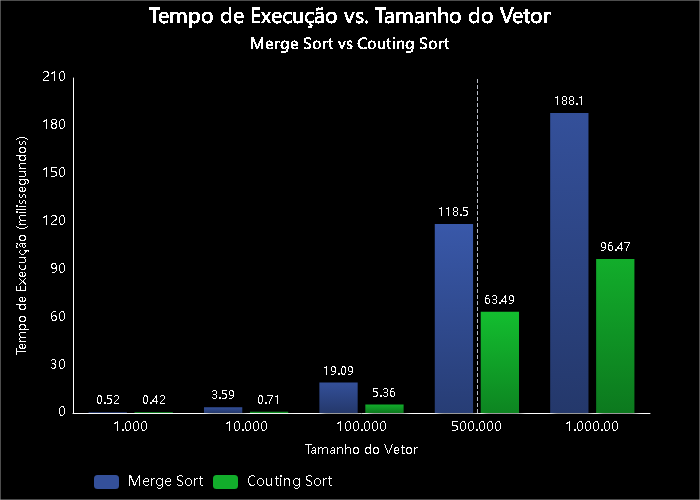
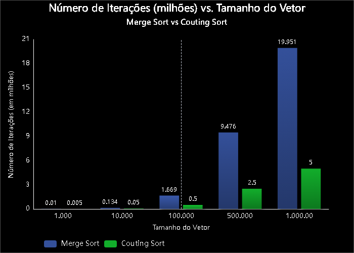
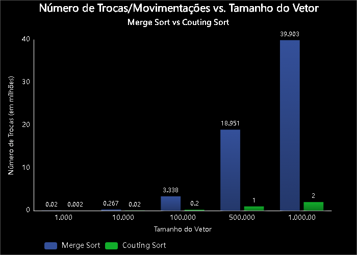

# 📊 Análise Comparativa de Algoritmos de Ordenação: Merge Sort vs. Counting Sort

Este projeto tem como objetivo realizar uma análise de desempenho detalhada entre dois algoritmos de ordenação: **Merge Sort**, um algoritmo de comparação baseado em "dividir para conquistar", e **Counting Sort**, um algoritmo de contagem não baseado em comparação.

A avaliação foi conduzida com base em três métricas principais:

1.  **Tempo de Execução:** O tempo real necessário para ordenar os vetores.
2.  **Número de Trocas/Movimentações:** A quantidade de operações de cópia ou movimentação de dados.
3.  **Número de Iterações:** Uma medida abstrata do "trabalho" ou dos passos lógicos executados pelo algoritmo.

O código-fonte completo e os dados brutos estão disponíveis neste repositório.

## 🧠 Sobre os Algoritmos

### Merge Sort

O Merge Sort é um exemplo clássico de algoritmo que utiliza a estratégia **"Dividir para Conquistar"**. Seu funcionamento consiste em:

1.  **Dividir:** O vetor é dividido recursivamente ao meio até que restem apenas sub-vetores de um único elemento (que, por definição, já estão ordenados).
2.  **Conquistar (ou Combinar):** Os sub-vetores são mesclados (merged) de forma ordenada, dois a dois, até que o vetor original esteja completamente reconstruído e ordenado.

- **Complexidade de Tempo:** $O(n \log n)$ em todos os casos (pior, médio e melhor). Isso o torna extremamente consistente e previsível.
- **Complexidade de Espaço:** $O(n)$, pois requer um vetor auxiliar do mesmo tamanho do original para realizar a mesclagem.

### Counting Sort

O Counting Sort opera de uma maneira fundamentalmente diferente. Por não ser baseado em comparações, ele consegue uma eficiência impressionante sob certas condições. Seu processo é:

1.  **Contar:** Ele primeiro encontra o maior valor (`k`) no vetor e cria um vetor auxiliar de contagem de tamanho `k+1`. Em seguida, ele percorre o vetor original, usando os valores como índices no vetor de contagem e incrementando a frequência de cada número.
2.  **Acumular:** O vetor de contagem é modificado para que cada posição contenha a soma de suas contagens anteriores. O valor em cada índice agora representa a posição final (ou o limite) daquele número no vetor ordenado.
3.  **Ordenar:** O vetor original é percorrido de trás para frente, e os elementos são colocados em um novo vetor de saída na posição indicada pelo vetor de contagem.

- **Complexidade de Tempo:** $O(n+k)$, onde `n` é o número de elementos e `k` é o intervalo dos valores de entrada. Se `k` for da ordem de `n`, a complexidade se torna linear, $O(n)$.
- **Complexidade de Espaço:** $O(k)$, para armazenar o vetor de contagem.
- **Principal Limitação:** Só é eficiente se o intervalo de valores (`k`) não for drasticamente maior que o número de elementos (`n`). Além disso, funciona primariamente para números inteiros.

---

## ⚙️ Metodologia de Análise

Para garantir uma comparação justa e precisa, a seguinte metodologia foi aplicada:

- **Ambiente:**
  - **Software:** Java (OpenJDK 23), Windows 10
- **Conjunto de Dados:**
  - Os testes foram executados em vetores de inteiros com tamanhos de **1.000, 10.000, 100.000, 500.000 e 1.000.000**.
  - Os vetores foram preenchidos com números aleatórios gerados no intervalo de `0` a `2*N` (onde N é o tamanho do vetor).
- **Execução:**
  - Para cada tamanho de vetor, foram realizadas **5 rodadas** com sementes (`seeds`) de aleatoriedade diferentes.
  - Os resultados apresentados (tempo, trocas, iterações) são a **média aritmética** dessas 5 rodadas, garantindo maior estabilidade e relevância estatística aos dados.

---

## 📈 Resultados e Análise

Os resultados consolidados da execução dos testes são apresentados na tabela abaixo.

Com certeza! Aqui está a sua tabela consolidada, agora preenchida com os dados reais e atualizados que você forneceu.

### Tabela Consolidada

| Tamanho       | Merge Sort (Média de 5 rodadas)                                              | Counting Sort (Média de 5 rodadas)                                       |
| :------------ | :--------------------------------------------------------------------------- | :----------------------------------------------------------------------- |
| **1.000**     | Tempo: 516.400 ns (0.52 ms), Trocas: 19.952, Iterações: 9.976                | Tempo: 418.800 ns (0.42 ms), Trocas: 2.000, Iterações: 4.995             |
| **10.000**    | Tempo: 3.588.260 ns (3.59 ms), Trocas: 267.232, Iterações: 133.616           | Tempo: 707.860 ns (0.71 ms), Trocas: 20.000, Iterações: 49.997           |
| **100.000**   | Tempo: 19.085.600 ns (19.09 ms), Trocas: 3.337.856, Iterações: 1.668.928     | Tempo: 5.360.700 ns (5.36 ms), Trocas: 200.000, Iterações: 499.997       |
| **500.000**   | Tempo: 118.504.640 ns (118.50 ms), Trocas: 18.951.424, Iterações: 9.475.712  | Tempo: 63.490.740 ns (63.49 ms), Trocas: 1.000.000, Iterações: 2.499.996 |
| **1.000.000** | Tempo: 188.097.080 ns (188.10 ms), Trocas: 39.902.848, Iterações: 19.951.424 | Tempo: 96.465.460 ns (96.47 ms), Trocas: 2.000.000, Iterações: 4.999.997 |

### Análise dos Gráficos

#### Gráfico 1: Tempo de Execução vs. Tamanho do Vetor

Este gráfico de barras ilustra de forma clara a superioridade do Counting Sort em termos de velocidade, especialmente para grandes volumes de dados.

- Para o **Merge Sort**, a **altura das barras azuis cresce de forma acentuada** à medida que o tamanho do vetor aumenta. Esse crescimento mais que proporcional representa visualmente sua complexidade.
- Para o **Counting Sort**, as **barras verdes também crescem, mas de maneira muito mais controlada e linear**. A comparação lado a lado em cada categoria torna a diferença de magnitude óbvia. Para 1 milhão de elementos, a barra do Merge Sort é mais que o dobro da altura da barra do Counting Sort.

#### Gráfico 2: Número de Iterações vs. Tamanho do Vetor

Este gráfico revela o "porquê" da diferença de velocidade: o volume de trabalho lógico.

- As barras do **Merge Sort** atingem **alturas massivas**, refletindo o número exponencial de comparações necessárias para ordenar os elementos.
- Em contrapartida, as barras do **Counting Sort** se mantêm **extremamente baixas e com um crescimento linear visível**. A escala do gráfico deixa claro que o "trabalho" do Counting Sort é de uma ordem de magnitude muito inferior.

#### Gráfico 3: Número de Trocas/Movimentações vs. Tamanho do Vetor

Este gráfico demonstra a eficiência de cada algoritmo na movimentação de dados.

- O **Merge Sort** novamente mostra um **padrão de crescimento acentuado na altura de suas barras**, indicando que ele precisa copiar muitos dados entre os vetores temporários e o original.
- O **Counting Sort**, por outro lado, exibe um **crescimento perfeitamente linear na altura de suas barras**, confirmando a teoria de que ele move cada elemento um número fixo de vezes.

---

## 🚀 Conclusão

Com base nos dados e gráficos apresentados, a conclusão é inequívoca: para a tarefa de ordenar vetores de inteiros com um intervalo de valores conhecido e gerenciável, o **Counting Sort é drasticamente mais eficiente** que o Merge Sort em todas as métricas analisadas.

No entanto, a escolha do algoritmo ideal sempre depende do contexto:

- **Escolha o Counting Sort quando:** Você precisa de máxima velocidade para ordenar **números inteiros** e o **intervalo de valores (`k`) é conhecido e não é excessivamente grande**. Ele é um algoritmo especialista e imbatível em seu nicho.

- **Escolha o Merge Sort quando:** Você precisa de um algoritmo **confiável, estável e de propósito geral**. Ele pode ordenar qualquer tipo de dado (strings, objetos) para o qual uma regra de comparação possa ser definida, e seu desempenho é consistente, não importando a distribuição dos dados de entrada. Ele é o "canivete suíço" dos algoritmos de ordenação.
